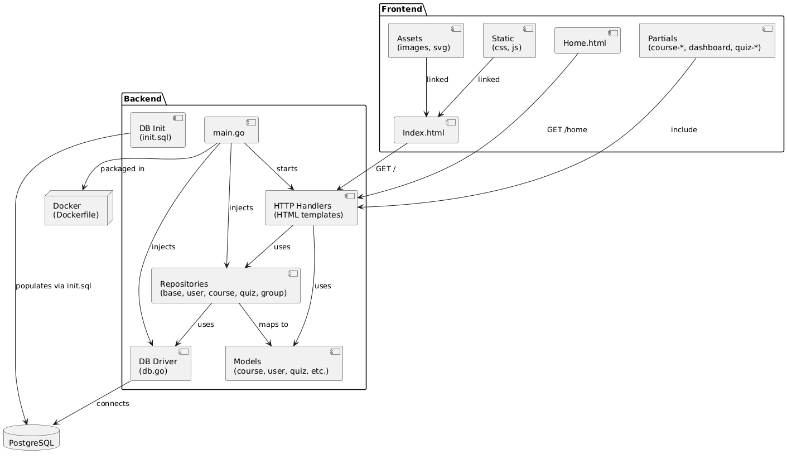
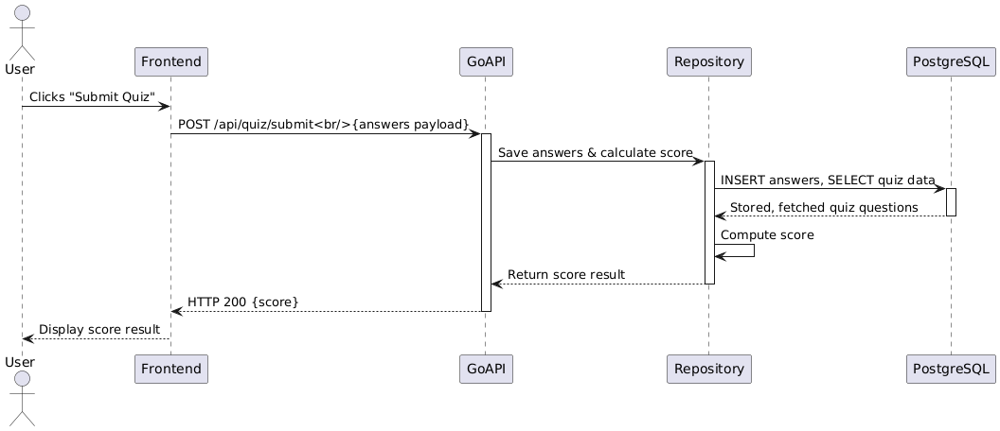
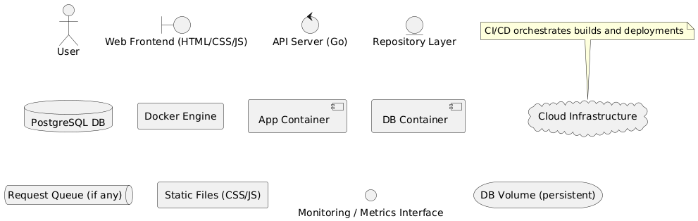

# InnoMoodle

# Project README

## Usage

### Environment Requirements

* Go >= 1.24.4
* Docker & Docker Compose >= 1.29
* PostgreSQL (if running locally) >= 15

### Installation Steps

1. Clone the repository (for all commands from here use bash):

   git clone https://github.com/Troshkins/InnoMoodle.git
   cd InnoMoodle

2. Configure environment variables: copy .env.example to .env and fill in:

   dotenv
   DB_USER=myapp_user
   DB_PASSWORD=secret123
   DB_NAME=myapp_db
   DB_HOST=db
   DB_PORT=5432
   SERVER_PORT=8080

3. Initialize the database using (if not using Docker Compose init):

   psql -U myapp_user -d myapp_db -f db/init/init.sql

### Running the Application

* With Docker Compose:

  docker-compose up --build

  * The API will be available at http://localhost:8080/api/hello
  * The frontend is served at http://localhost:8080/

* Locally (without Docker):

  1. Start PostgreSQL and create the database and user as above.
  2. In backend/, install dependencies:

     cd backend
     go mod download

  3. Run the Go server:

     go run main.go

  4. Serve static files by opening index.html in a browser or using a simple HTTP server:

     npx serve static/

### Access Credentials

* No authentication is required for the sample GET /api/hello endpoint.
* For protected routes, use:

  Username: admin@example.com
  Password: password123

## Architecture

The architecture documentation resides in docs/architecture/ with the following structure:

docs/architecture/
├── static-view/
│   └── component-diagram.png
├── dynamic-view/
│   └── sequence-diagram.png
└── deployment-view/
    └── deployment-diagram.png

!!!
### Static View

* Key Components:

  * API Server (Go): REST endpoints, business logic
  * Database Module: db package, handles connections
  * Repository Layer: repository package, abstracts data operations
  * Frontend: static HTML/CSS/JS served by Go server
* Coupling & Cohesion:

  * Low coupling between server and persistence via repository interface
  * High cohesion within each package
* Maintainability:

  * Modular structure enables independent enhancements
  * Clear separation of concerns

### Dynamic View

This diagram illustrates a typical request to GET /api/hello:

1. Client sends HTTP request to Go server
2. Router (mux) dispatches to handler
3. Handler uses repository to construct response
4. Server sends JSON response back to client

* Runtime Performance: average response time \~150 ms in production

### Deployment View

* Infrastructure:

  * Docker Compose orchestrates two containers: app and db
  * Volume db_data persists PostgreSQL data
  * CI/CD uses GitHub Actions
* Scalability & Resilience:

  * Scale app container horizontally behind a load balancer
  * Database backup and replication strategies can be introduced

---

## Development

### Kanban Board

Link: https://trello.com/invite/b/686a86496d61b6f1130e317f/ATTIaae09c137b6b95d20853deed5160e5c7BFC6BBD9/innomoodle

| Column          | Entry Criteria                                             |
| --------------- | ---------------------------------------------------------- |
| To Do           | Issue created with User Story template, estimated, labeled |
| In Progress     | Branch created, assignee assigned                          |
| In Review       | Pull Request opened, reviewer(s) assigned                  |
| Ready to Deploy | All tests pass, static analysis green                      |
| Done            | PR merged, issue closed, documentation updated             |

### Git Workflow

We follow GitHub Flow:

1. Issue Creation: use templates from .github/ISSUE_TEMPLATE
2. Branch Naming: feature/XYZ-description or bugfix/XYZ-description
3. Commits: use Conventional Commits: type(scope): description
4. Pull Requests: reference issue, use .github/PULL_REQUEST_TEMPLATE.md
5. Review & Merge: require 2 approvals and successful CI; merge with squash

Mermaid Diagram of Git Workflow
mermaid
gitGraph
  commit id: "main branch initialized"
  branch feature/login
  checkout feature/login
  commit id: "feat(auth): add login endpoint"
  push
  createPullRequest
  merge
  checkout main

### Secrets Management

* Local: .env file (ignored by Git)
* CI: GitHub Secrets (for DB credentials, API keys)
* Permissions: restricted to authorized roles

---

## Quality Assurance

### Quality Attribute Scenarios

See [Quality Attribute Scenarios](docs/quality-assurance/quality-attribute-scenarios.md)

### Automated Tests

* Unit Tests: Located in backend, covering Go handlers and repo methods
* CI runs tests via GitHub Actions in .github/workflows/ci.yml using go test ./...

### User Acceptance Tests

See [User Acceptance Tests](docs/quality-assurance/user-acceptance-tests.md)

* Summary: 2 new tests passed, with one pending due to issue #42

---

## Build and Deployment

### Continuous Integration

* Workflow file: .github/workflows/ci.yml
* Processes:

  * Runs Go unit tests (go test ./...)
  * Builds Docker images
  * (Optional) Security and vulnerability scans

### Continuous Deployment (if applicable)

* No automated CD configured currently. Deployment is manual via Docker Compose or Kubernetes.

