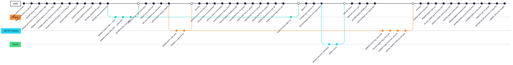

# Kanban Board

Link: https://trello.com/invite/b/686a86496d61b6f1130e317f/ATTIaae09c137b6b95d20853deed5160e5c7BFC6BBD9/innomoodle

| Column          | Entry Criteria                                             |
| --------------- | ---------------------------------------------------------- |
| To Do           | discussed with customer or with team and planned for sprint|
| In Progress     | Branch created, assignee assigned                          |
| Testing         | task completed, reviewer assigned                          |
| Done            | tests passed, reviewer agreed,                             |
|                 | issue closed, documentation updated                        |

# Git Workflow

We follow GitHub Flow:

1. Issue Creation: use templates from .github/ISSUE_TEMPLATE
2. Branch Naming: feature/XYZ-description or bugfix/XYZ-description
3. Commits: use Base Commits: description
4. Pull Requests: reference issue, use .github/PULL_REQUEST_TEMPLATE.md
5. Review & Merge: require 2 approvals and successful CI; merge with squash

Mermaid Diagram of Git Workflow
mermaid
gitGraph
  commit id: "main branch initialized"
  branch feature/login
  checkout feature/login
  commit id: "feat(auth): add login endpoint"
  push
  createPullRequest
  merge
  checkout main

# Secrets Management

* Local: .env file (ignored by Git)
* CI: GitHub Secrets (for DB credentials, API keys)
* Permissions: restricted to authorized roles
